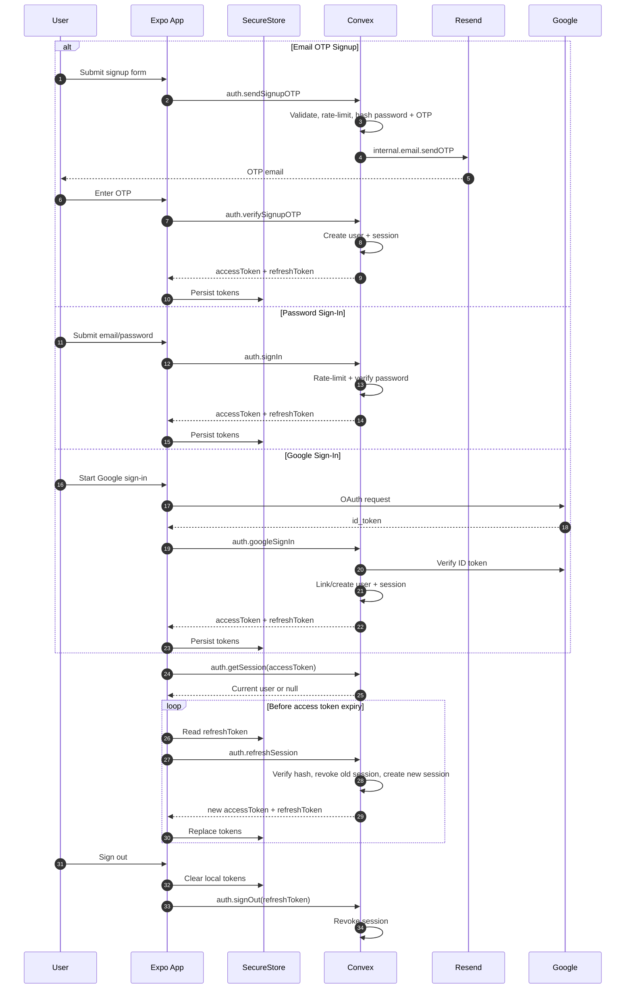

# Auth Flow Diagram

```mermaid
---
id: fa2531f0-d9f1-4d81-bfe1-ae1782b2b3d9
---
sequenceDiagram
    autonumber
    participant User
    participant App as Expo App
    participant Store as SecureStore
    participant Convex
    participant Email as Resend
    participant Google

    alt Email OTP Signup
        User->>App: Submit signup form
        App->>Convex: auth.sendSignupOTP
        Convex->>Convex: Validate, rate-limit, hash password + OTP
        Convex->>Email: internal.email.sendOTP
        Email-->>User: OTP email
        User->>App: Enter OTP
        App->>Convex: auth.verifySignupOTP
        Convex->>Convex: Create user + session
        Convex-->>App: accessToken + refreshToken
        App->>Store: Persist tokens
    else Password Sign-In
        User->>App: Submit email/password
        App->>Convex: auth.signIn
        Convex->>Convex: Rate-limit + verify password
        Convex-->>App: accessToken + refreshToken
        App->>Store: Persist tokens
    else Google Sign-In
        User->>App: Start Google sign-in
        App->>Google: OAuth request
        Google-->>App: id_token
        App->>Convex: auth.googleSignIn
        Convex->>Google: Verify ID token
        Convex->>Convex: Link/create user + session
        Convex-->>App: accessToken + refreshToken
        App->>Store: Persist tokens
    end

    App->>Convex: auth.getSession(accessToken)
    Convex-->>App: Current user or null

    loop Before access token expiry
        App->>Store: Read refreshToken
        App->>Convex: auth.refreshSession
        Convex->>Convex: Verify hash, revoke old session, create new session
        Convex-->>App: new accessToken + refreshToken
        App->>Store: Replace tokens
    end

    User->>App: Sign out
    App->>Store: Clear local tokens
    App->>Convex: auth.signOut(refreshToken)
    Convex->>Convex: Revoke session
```
