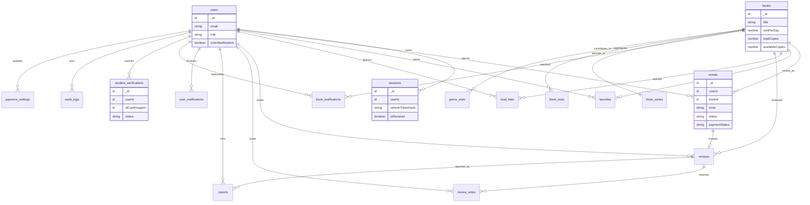

# Convex Data Model Diagram

```mermaid
---
id: 6086303d-d0c2-4348-ab6c-b4381e214ff8
---
erDiagram
    users ||--o{ sessions : owns
    users ||--o{ rentals : places
    users ||--o{ favorites : saves
    users ||--o{ read_later : queues
    users ||--o{ reviews : writes
    users ||--o{ review_votes : votes
    users ||--o{ reports : files
    users ||--o{ user_notifications : receives
    users ||--o{ book_notifications : subscribes
    users ||--o{ student_verifications : submits
    users ||--o{ audit_logs : acts
    users ||--o{ payment_settings : updates

    books ||--o{ rentals : rented_as
    books ||--o{ favorites : favorited
    books ||--o{ read_later : queued
    books ||--o{ reviews : reviewed
    books ||--o{ book_notifications : watched
    books }o--|| book_series : belongs_to
    books ||--o{ book_stats : aggregates
    books ||--o{ genre_stats : contributes_to

    rentals ||--o| reviews : creates
    reviews ||--o{ review_votes : receives
    reviews ||--o{ reports : reported_by

    users {
        id _id
        string email
        string role
        boolean isVerifiedStudent
    }

    books {
        id _id
        string title
        number rentPerDay
        number totalCopies
        number availableCopies
    }

    rentals {
        id _id
        id userId
        id bookId
        string zone
        string status
        string paymentStatus
    }

    student_verifications {
        id _id
        id userId
        id idCardImageId
        string status
    }

    sessions {
        id _id
        id userId
        string refreshTokenHash
        boolean isRevoked
    }
```
