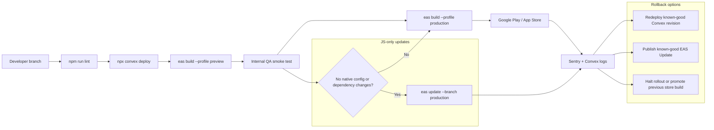

# Deployment Flow Diagram

```mermaid
flowchart LR
    Dev["Developer branch"]
    Lint["npm run lint"]
    ConvexDeploy["npx convex deploy"]
    PreviewBuild["eas build --profile preview"]
    QA["Internal QA smoke test"]
    ProdBuild["eas build --profile production"]
    Store["Google Play / App Store"]
    Monitor["Sentry + Convex logs"]

    Dev --> Lint
    Lint --> ConvexDeploy
    ConvexDeploy --> PreviewBuild
    PreviewBuild --> QA
    QA --> ProdBuild
    ProdBuild --> Store
    Store --> Monitor

    subgraph Updates["JS-only updates"]
        OTA["eas update --branch production"]
        RuntimeCheck{"No native config or dependency changes?"}
    end

    QA --> RuntimeCheck
    RuntimeCheck -- Yes --> OTA
    OTA --> Monitor
    RuntimeCheck -- No --> ProdBuild

    subgraph Rollback["Rollback options"]
        BackendRollback["Redeploy known-good Convex revision"]
        OtaRollback["Publish known-good EAS Update"]
        NativeRollback["Halt rollout or promote previous store build"]
    end

    Monitor --> BackendRollback
    Monitor --> OtaRollback
    Monitor --> NativeRollback
```
