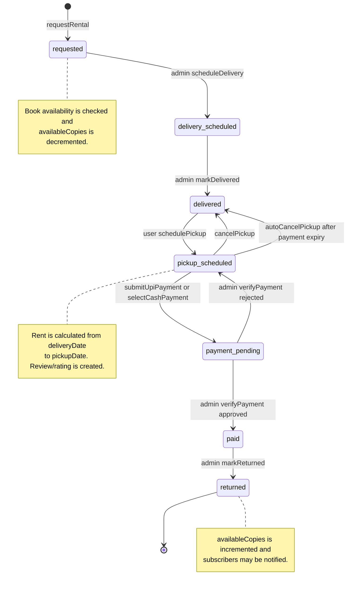

# Rental Lifecycle Diagram

```mermaid
stateDiagram-v2
    [*] --> requested: requestRental

    requested --> delivery_scheduled: admin scheduleDelivery
    delivery_scheduled --> delivered: admin markDelivered
    delivered --> pickup_scheduled: user schedulePickup

    pickup_scheduled --> payment_pending: submitUpiPayment or selectCashPayment
    payment_pending --> paid: admin verifyPayment approved
    payment_pending --> pickup_scheduled: admin verifyPayment rejected

    pickup_scheduled --> delivered: cancelPickup
    pickup_scheduled --> delivered: autoCancelPickup after payment expiry

    paid --> returned: admin markReturned
    returned --> [*]

    note right of requested
        Book availability is checked and
        availableCopies is decremented.
    end note

    note right of pickup_scheduled
        Rent is calculated from deliveryDate
        to pickupDate. Review/rating is created.
    end note

    note right of returned
        availableCopies is incremented and
        subscribers may be notified.
    end note
```
