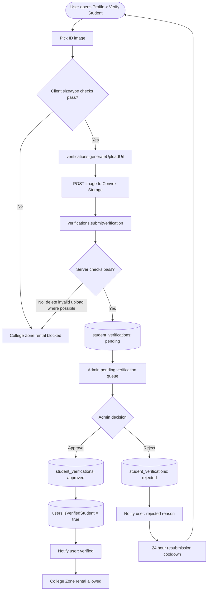

# Student Verification Diagram

```mermaid
flowchart TB
    Start([User opens Profile > Verify Student])
    Pick["Pick ID image"]
    ClientChecks{"Client size/type checks pass?"}
    UploadUrl["verifications.generateUploadUrl"]
    Upload["POST image to Convex Storage"]
    Submit["verifications.submitVerification"]
    ServerChecks{"Server checks pass?"}
    Pending[("student_verifications: pending")]
    AdminQueue["Admin pending verification queue"]
    Decision{"Admin decision"}
    Approved[("student_verifications: approved")]
    Rejected[("student_verifications: rejected")]
    UserVerified[("users.isVerifiedStudent = true")]
    NotifyApproved["Notify user: verified"]
    NotifyRejected["Notify user: rejected reason"]
    Cooldown["24 hour resubmission cooldown"]
    CollegeAccess["College Zone rental allowed"]
    Blocked["College Zone rental blocked"]

    Start --> Pick
    Pick --> ClientChecks
    ClientChecks -- No --> Blocked
    ClientChecks -- Yes --> UploadUrl
    UploadUrl --> Upload
    Upload --> Submit
    Submit --> ServerChecks
    ServerChecks -- No: delete invalid upload where possible --> Blocked
    ServerChecks -- Yes --> Pending
    Pending --> AdminQueue
    AdminQueue --> Decision
    Decision -- Approve --> Approved
    Approved --> UserVerified
    UserVerified --> NotifyApproved
    NotifyApproved --> CollegeAccess
    Decision -- Reject --> Rejected
    Rejected --> NotifyRejected
    NotifyRejected --> Cooldown
    Cooldown --> Start
```
