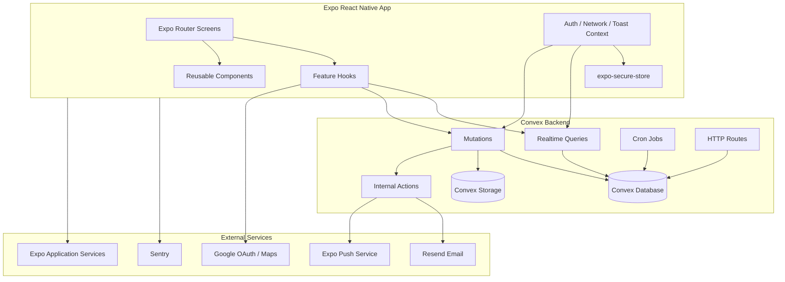

# System Architecture Diagram

```mermaid
flowchart TB
    subgraph Mobile["Expo React Native App"]
        Screens["Expo Router Screens"]
        Hooks["Feature Hooks"]
        Context["Auth / Network / Toast Context"]
        UI["Reusable Components"]
        SecureStore["expo-secure-store"]
    end

    subgraph Convex["Convex Backend"]
        Queries["Realtime Queries"]
        Mutations["Mutations"]
        Actions["Internal Actions"]
        Crons["Cron Jobs"]
        DB[("Convex Database")]
        Storage[("Convex Storage")]
        HTTP["HTTP Routes"]
    end

    subgraph External["External Services"]
        Google["Google OAuth / Maps"]
        Resend["Resend Email"]
        ExpoPush["Expo Push Service"]
        Sentry["Sentry"]
        EAS["Expo Application Services"]
    end

    Screens --> Hooks
    Screens --> UI
    Hooks --> Queries
    Hooks --> Mutations
    Context --> SecureStore
    Context --> Queries
    Context --> Mutations

    Queries --> DB
    Mutations --> DB
    Mutations --> Storage
    Mutations --> Actions
    Crons --> DB
    HTTP --> DB

    Actions --> Resend
    Actions --> ExpoPush
    Hooks --> Google
    Mobile --> Sentry
    Mobile --> EAS
```
